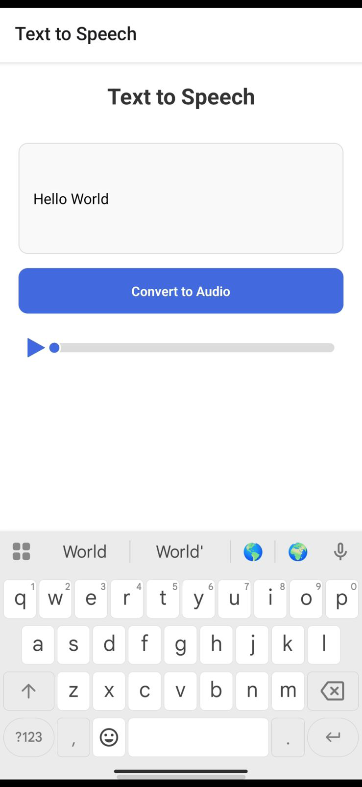
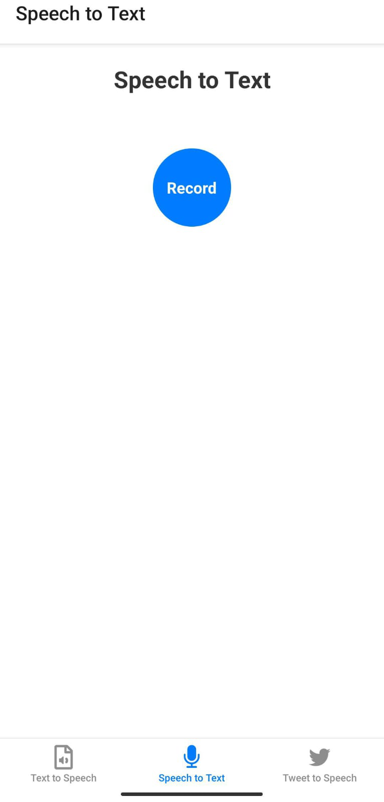
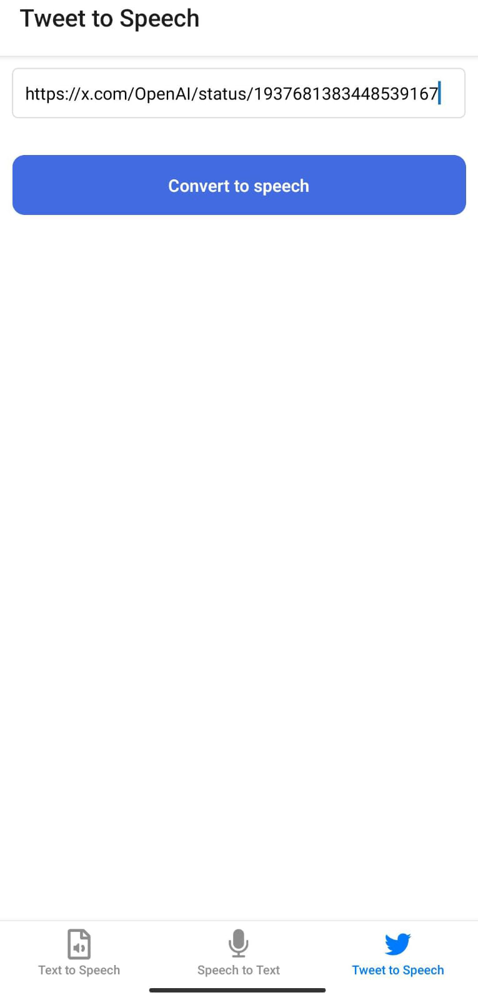

# 🎤 TextToSpeech - AI-Powered Voice App

<div align="center">


**Transform text into natural speech and convert speech back to text using cutting-edge AI technology**

[🚀 Live Demo](#live-demo) • [📱 Download APK](https://expo.dev/accounts/tharunrega/projects/TextToSpeech/builds/df25e671-4208-4b2f-a2e6-a9c3e6a38482) • [🛠️ Installation](#installation) • [🎯 Features](#features)

</div>

---

## ✨ Overview

TextToSpeech is a modern React Native mobile application that leverages **ElevenLabs AI** to provide high-quality text-to-speech and speech-to-text functionality. Built with Expo and TypeScript, it offers a seamless cross-platform experience with professional-grade voice synthesis and recognition.

## 🎯 Key Features

### 🗣️ **Text to Speech**
- Convert written text into natural-sounding audio
- Multiple voice models and languages
- High-quality MP3 output
- Real-time audio generation

### 🎤 **Speech to Text**
- Accurate speech recognition
- Real-time transcription
- Support for multiple languages
- Professional audio recording

### 🐦 **Tweet to Speech** *(Coming Soon)*
- Convert Twitter posts into audio
- Social media integration
- Share audio content easily

### 📱 **Cross-Platform**
- Works on iOS and Android
- Responsive design
- Native performance
- Offline capability

## 🛠️ Technology Stack

- **Frontend**: React Native 0.79.4
- **Framework**: Expo SDK 53
- **Language**: TypeScript 5.8.3
- **AI Engine**: ElevenLabs API
- **Audio**: Expo Audio Module
- **Navigation**: Expo Router
- **Styling**: React Native StyleSheet

## 📱 Screenshots

<div align="center">

| Text to Speech | Speech to Text | Tweet to Speech |
|:---:|:---:|:---:|
|  |  |  |

*Add your app screenshots here*

</div>

## 🚀 Live Demo

### **Option 1: Expo Go (Recommended)**
1. Install [Expo Go](https://expo.dev/client) on your phone
2. Scan the QR code from the development server
3. Experience the app in real-time

### **Option 2: Web Demo**
- [Expo Snack Demo](https://snack.expo.dev) *(Coming Soon)*

## 📥 Download APK

**Direct Download**: [TextToSpeech APK](https://expo.dev/accounts/tharunrega/projects/TextToSpeech/builds/1b3555de-425b-4fd9-b3f8-73aa66dc6740)

**Build Information**:
- Version: 1.0.0
- Platform: Android
- Size: ~25MB
- API Level: 21+

## 🛠️ Installation & Setup

### Prerequisites
- Node.js (v16 or higher)
- npm or yarn
- Expo CLI
- Android Studio (for Android development)
- Xcode (for iOS development, macOS only)

### Quick Start

1. **Clone the repository**
   ```bash
   git clone https://github.com/tharunrega/texttospeech-app.git
   cd texttospeech-app
   ```

2. **Install dependencies**
   ```bash
   npm install
   ```

3. **Set up API keys**
   Create a `.env` file in the root directory:
   ```env
   ELEVENLABS_API_KEY=your_elevenlabs_api_key_here
   BRIGHT_DATA_API_KEY=your_bright_data_api_key_here
   ```

4. **Start the development server**
   ```bash
   npm start
   ```

5. **Run on device**
   - Install Expo Go on your phone
   - Scan the QR code with Expo Go
   - Or press 'a' for Android emulator, 'i' for iOS simulator

### API Keys Setup

#### **ElevenLabs API Key**
1. Sign up at [ElevenLabs](https://elevenlabs.io/)
2. Get your API key from the dashboard
3. Add it to your `.env` file

#### **Bright Data API Key** (for Tweet to Speech feature)
1. Sign up at [Bright Data](https://brightdata.com/)
2. Get your API key
3. Add it to your `.env` file

## 📁 Project Structure

```
TextToSpeech/
├── src/
│   ├── app/
│   │   ├── api/           # API routes (if needed)
│   │   ├── index.tsx      # Main TTS screen
│   │   ├── speech-to-text.tsx
│   │   ├── tweet-to-speech.tsx
│   │   └── _layout.tsx    # Tab navigation
│   └── components/        # Reusable components
│       ├── AudioPlayer.tsx
│       ├── CustomButton.tsx
│       └── DummyTweet.tsx
├── assets/               # Images and icons
├── app.json             # Expo configuration
├── package.json         # Dependencies
└── README.md           # This file
```

## 🎮 Usage

### Text to Speech
1. Navigate to the "Text to Speech" tab
2. Enter the text you want to convert
3. Tap "Convert to Audio"
4. Play the generated audio using the audio player

### Speech to Text
1. Navigate to the "Speech to Text" tab
2. Tap the record button
3. Speak clearly into your microphone
4. View the transcribed text

### Tweet to Speech
1. Navigate to the "Tweet to Speech" tab
2. Enter a Twitter URL
3. Convert the tweet content to audio

## 🔨 Building for Production

### Android APK
```bash
# Using EAS Build (recommended)
eas build --platform android --profile preview

# Or using Expo Development Build
npx expo run:android
```

### iOS IPA
```bash
# Using EAS Build
eas build --platform ios --profile preview

# Or using Expo Development Build
npx expo run:ios
```

## 🧪 Testing

### Manual Testing
- Test all three main features
- Verify audio playback works
- Check speech recognition accuracy
- Test on different devices

### Automated Testing
```bash
npm test
```

## 🐛 Troubleshooting

### Common Issues

1. **API Key Error**
   - Ensure your ElevenLabs API key is correctly set
   - Check that the key has sufficient credits

2. **Audio Playback Issues**
   - Check device volume
   - Ensure microphone permissions are granted
   - Restart the app if needed

3. **Build Errors**
   - Clear cache: `npx expo start --clear`
   - Update dependencies: `npm update`
   - Check Expo SDK compatibility

4. **QR Code Scanning Issues**
   - Ensure both devices are on the same WiFi
   - Try tunnel mode: Press `t` in terminal
   - Update Expo Go to latest version

## 🤝 Contributing

We welcome contributions! Please follow these steps:

1. Fork the repository
2. Create a feature branch: `git checkout -b feature-name`
3. Make your changes
4. Commit your changes: `git commit -m 'Add feature'`
5. Push to the branch: `git push origin feature-name`
6. Submit a pull request

### Development Guidelines
- Follow TypeScript best practices
- Add proper error handling
- Include comments for complex logic
- Test on both iOS and Android

## 📄 License

This project is licensed under the MIT License - see the [LICENSE](LICENSE) file for details.

## 🙏 Acknowledgments

- [ElevenLabs](https://elevenlabs.io/) for providing the AI voice technology
- [Expo](https://expo.dev/) for the development platform
- [React Native](https://reactnative.dev/) for the framework
- [Kahani Kids Team](https://github.com/kahanikids) for the project

## 📞 Support

- **Email**: support@kahanikids.com
- **Issues**: [GitHub Issues](https://github.com/tharunrega/texttospeech-app/issues)
- **Documentation**: [Wiki](https://github.com/tharunrega/texttospeech-app/wiki)

## 🔗 Links

- [Live Demo](https://expo.dev/@tharunrega/texttospeech)
- [API Documentation](https://elevenlabs.io/docs)
- [Expo Documentation](https://docs.expo.dev/)
- [React Native Docs](https://reactnative.dev/docs/getting-started)

## 📊 Project Stats


---

<div align="center">

**Built with ❤️ by the [Kahani Kids Team](https://github.com/kahanikids)**

[⭐ Star this repo](https://github.com/tharunrega/texttospeech-app) • [🐛 Report an issue](https://github.com/tharunrega/texttospeech-app/issues) • [📖 View documentation](https://github.com/tharunrega/texttospeech-app/wiki)

</div> 
